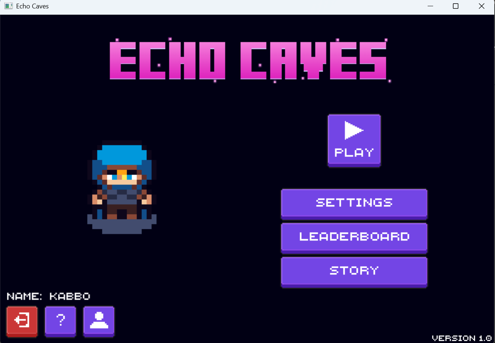
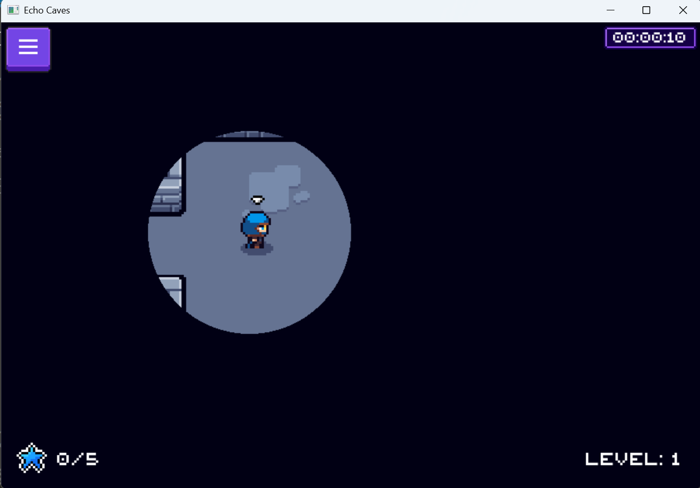

# 🎮 Echo Caves

**Echo Caves** is a 2D sound-based adventure game developed as a course project for  **CSE 102: Structured Programming Language**, Level 1 Term 1,  Department of Computer Science and Engineering, **BUET**.

---

## 🖼️ Screenshots

  
   <em>Main Menu</em>

  
   <em>Exploring the cave using sound pulses</em>

---

## 🧭 Game Overview

You play as an explorer trapped in a pitch-black cave. You can't see — you must rely on **sound pulses** to briefly reveal the surrounding cave walls and obstacles, simulating **echolocation**. Navigate carefully, avoid hazards, and try to escape the depths.

The game is built using the **iGraphics** graphics library in the **C programming language**.

---

## 🔧 Features

- Echolocation-based cave navigation
- 2D sprite-based character animations
- Sound feedback for user interaction
- Screen transitions: Main Menu, Gameplay, Game Over, Leaderboard
- Leaderboard using file I/O
- Modular C code structure using functions

---

## 👨‍💻 Developers

- **Md Mishkatul Habib**  
  CSE '24  
  Bangladesh University of Engineering and Technology (BUET)

- **Yeasin Anzam Rifat**  
  CSE '24  
  Bangladesh University of Engineering and Technology (BUET)

---
---

## 📁 Project Context

This game was developed as part of the CSE 102 curriculum to demonstrate structured programming, graphics handling, and interactive game development using C.

